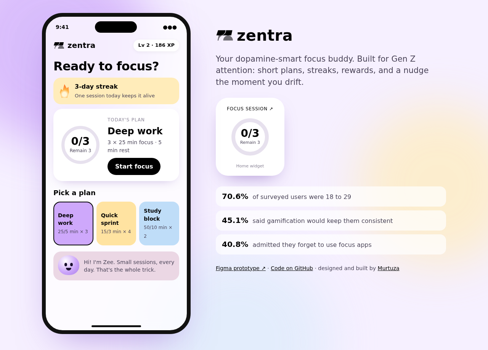
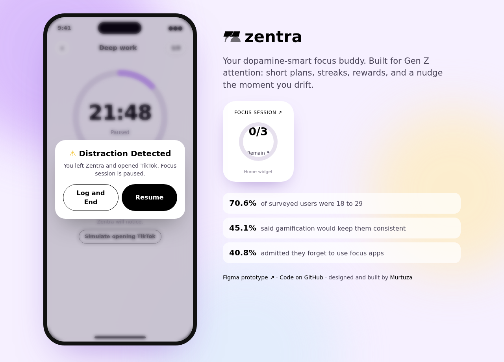
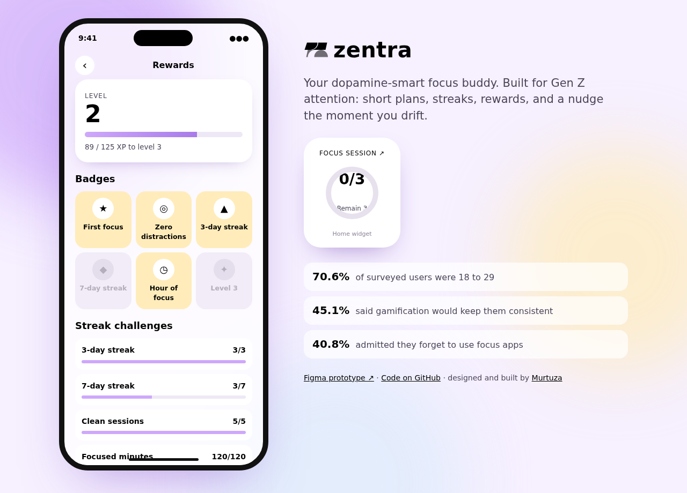
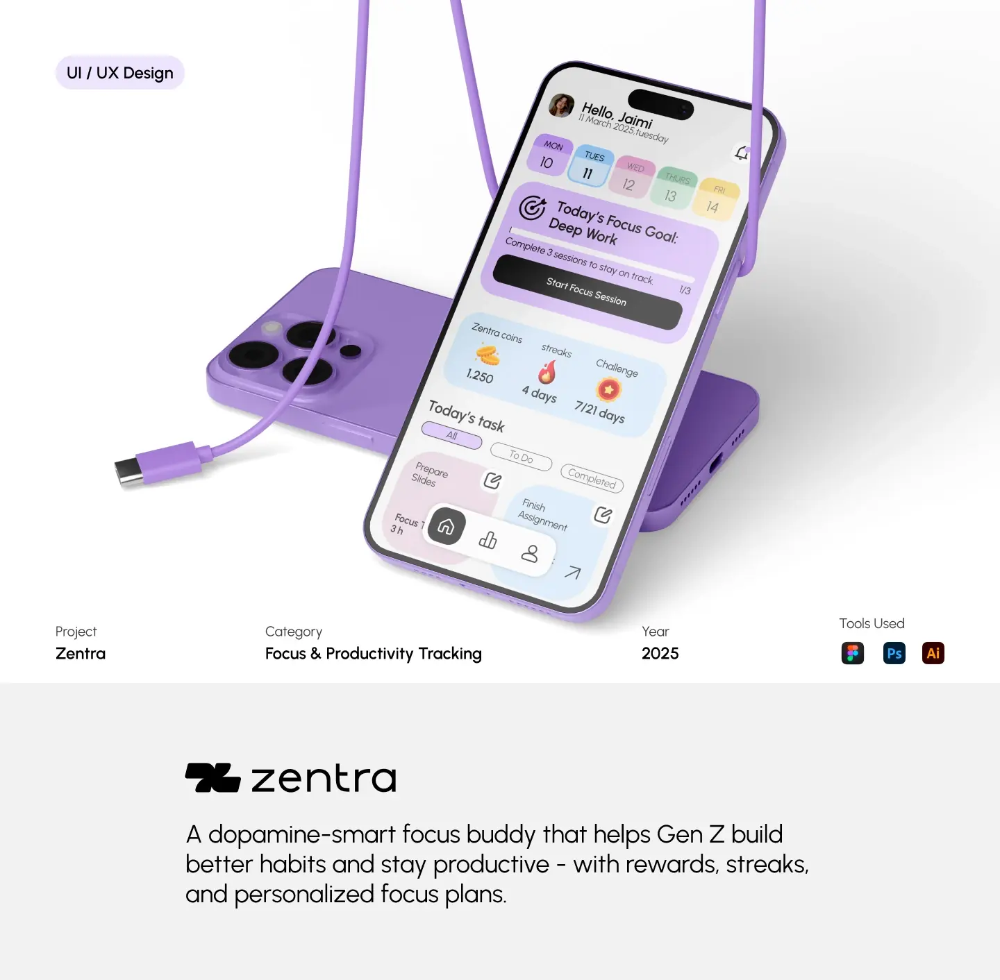
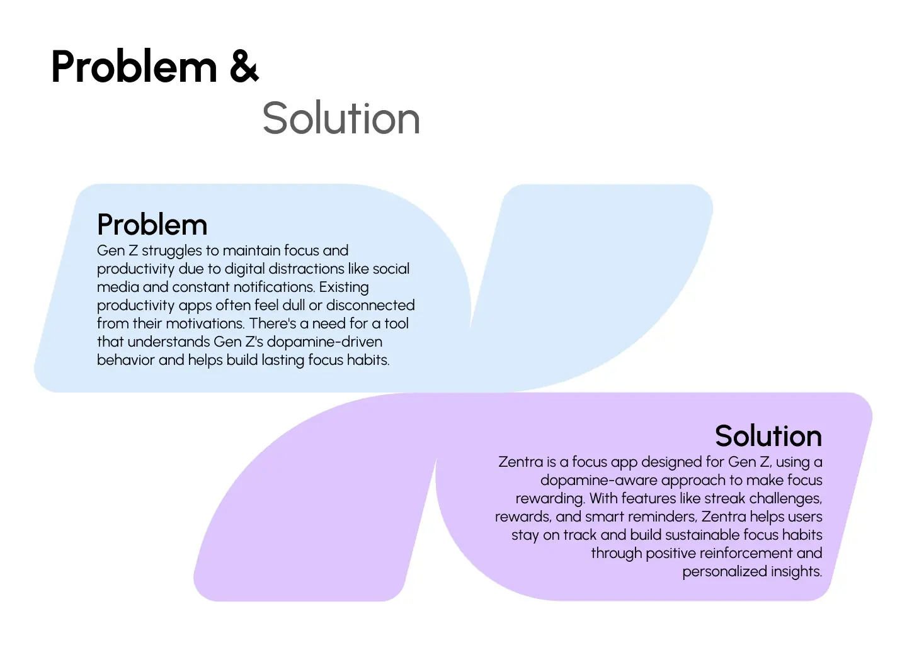
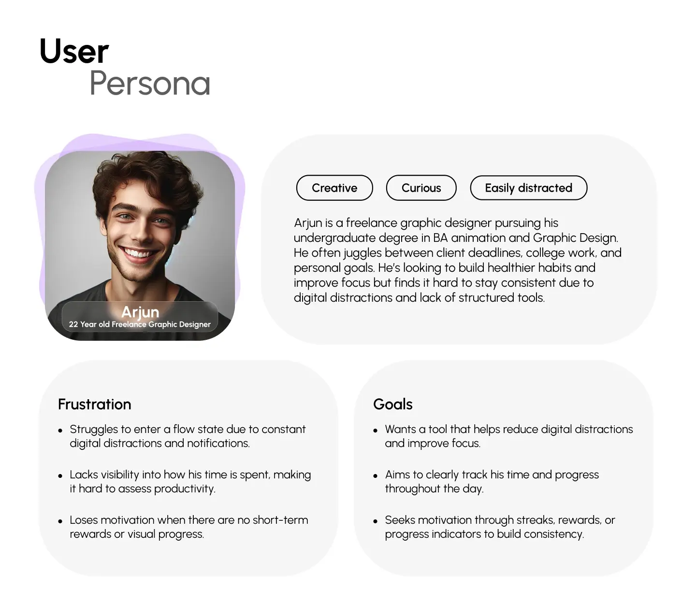
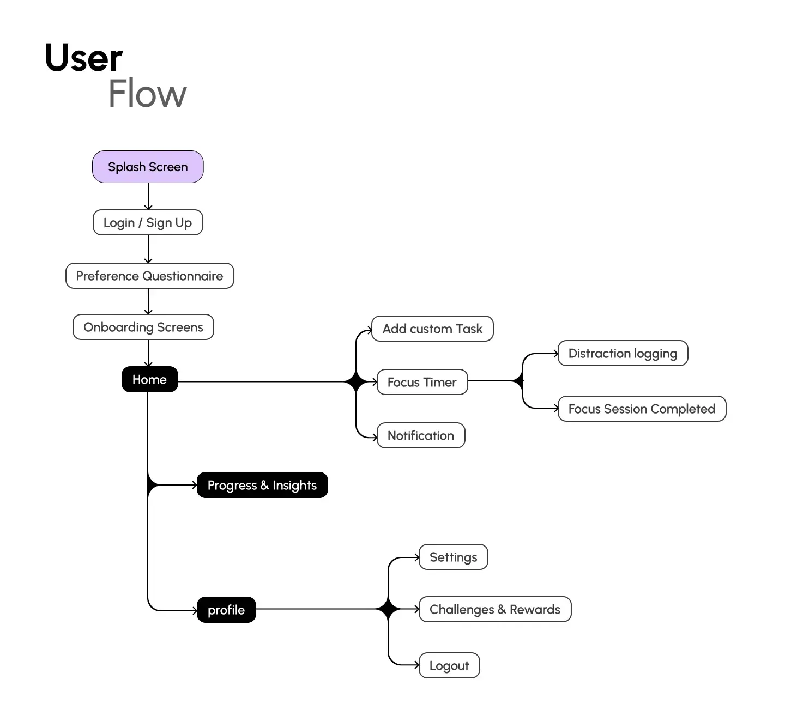
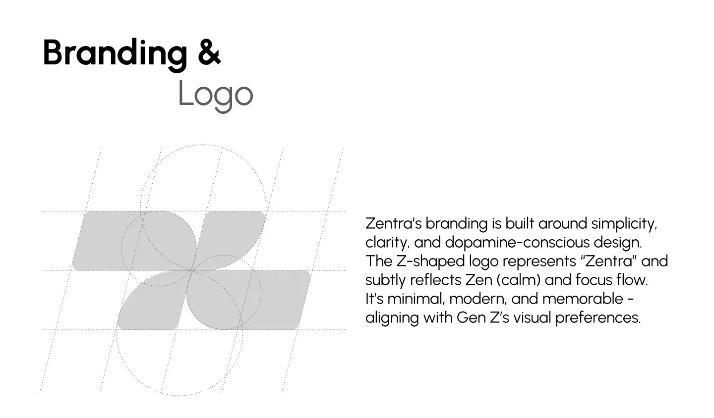
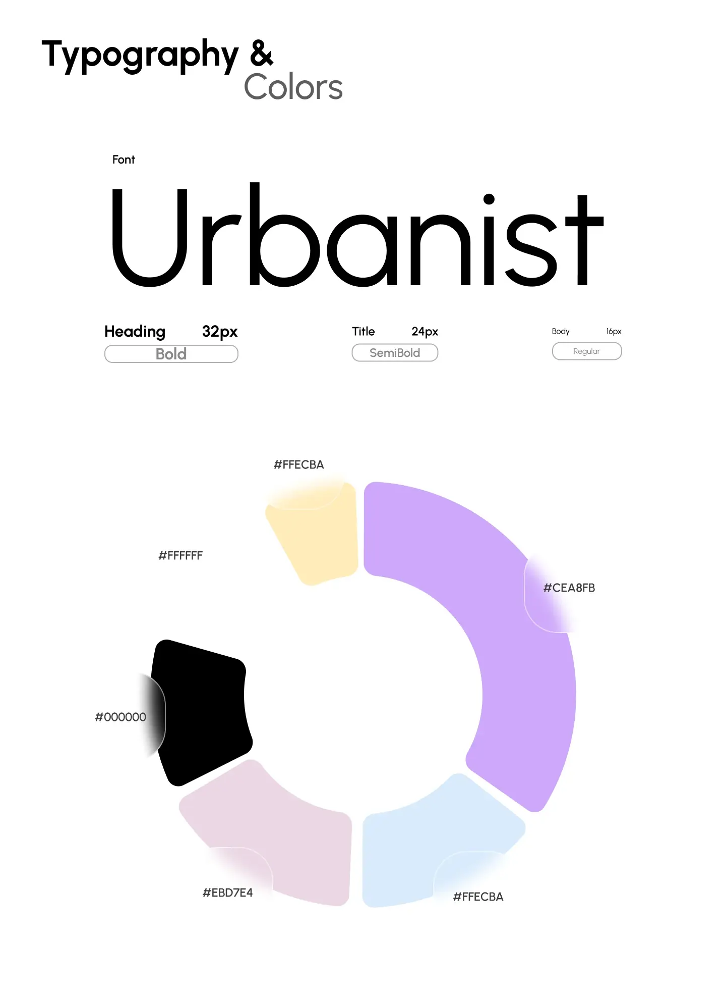

# Zentra

**Your dopamine-smart focus buddy.** A focus app designed for Gen Z attention: short focus plans, streaks, rewards, and a nudge the moment you drift. This repo is the coded, clickable prototype of the Zentra UX/UI case study, built on the case study's brand and design tokens.

**[Open the coded prototype →](https://murtuzabuilds.github.io/zentra/)** &nbsp;·&nbsp; **[Figma prototype ↗](https://www.figma.com/proto/QCwAM425MJNSONRtJzkJIb/Zentra-Mobile-App-Design?content-scaling=fixed&kind=proto&node-id=379-338&page-id=0%3A1&scaling=scale-down&starting-point-node-id=371%3A5)**



## Why it exists

Most focus apps are built for people who already have discipline. Zentra is built for people who don't have it yet. The research behind the design:

| Finding | What it changed |
|---|---|
| **70.6%** of survey participants were 18 to 29 | Tone, colour and pacing tuned for Gen Z, not for productivity power users |
| **45.1%** said gamification would keep them consistent | XP, levels, streaks and badges are the core loop, not decoration |
| **40.8%** said they forget to use focus apps | A home screen widget keeps today's plan in sight |
| **33.3%** want progress as visual stats | Rings and progress bars everywhere, numbers second |

## Figma to code

The Figma file is the source of truth for the experience; this repo proves it works. Where the Figma prototype fakes a state, the code makes it real:

| In Figma | In code |
|---|---|
| Distraction Detected modal, triggered by a hotspot | Fires on a real `visibilitychange`: switch tabs mid-session and the timer pauses with the modal waiting when you return. A "Simulate opening TikTok" button shows the exact case study moment |
| Static "Focus Session 1/3, Remain 2" widget | Live ring driven by today's completed sessions |
| Rewards and badges screen | XP, levels and six badges computed from your actual sessions, stored locally |
| Colour and type styles | `tokens/design-tokens.json` (W3C format) compiled to `tokens/tokens.css` |



## The focus engine

`src/focus.js` is small, pure and tested, so the product rules are readable:

| Rule | Logic |
|---|---|
| Plans | Deep work (3 × 25/5), Quick sprint (4 × 15/3), Study block (2 × 50/10) |
| XP | 1 per focused minute, +10 for a distraction-free session, streak multiplier up to 1.5× |
| Levels | 100 XP for level 2, each level needs 25% more |
| Streak | Consecutive days with a finished session. Today counts as safe until midnight |
| Badges | First focus, Zero distractions, 3-day and 7-day streak, Hour of focus, Level 3 |

Logging a partial session still earns XP for the minutes you did. Short is fine; zero is what breaks the habit.



## Run it

```bash
npm test          # 6 tests, no dependencies
npx serve .       # or any static server
```

Tick **Demo speed** on the focus screen to run a 25 minute session in 25 seconds.

## Brand

| Token | Value |
|---|---|
| Lavender (primary) | `#CEA8FB` |
| Butter | `#FFECBA` |
| Blush | `#EBD7E4` |
| Sky | `#DCEBFB` |
| Ink / White | `#000000` / `#FFFFFF` |
| Type | Urbanist |

## Case study

| | |
|---|---|
|  |  |
|  |  |
|  |  |

---

Research, brand, design and code by [Murtuza](https://github.com/murtuzabuilds). MIT licensed.
